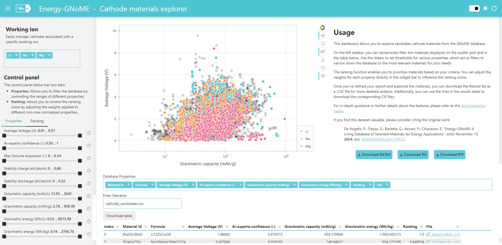

# How to use the *Cathode* materials dashboard

The *Cathode* materials dashboard empowers you to explore candidate **cathodes** materials from the Energy-GNoME database. This interactive tool enables detailed filtering, ranking, and analysis of materials based on their properties and AI-predicted metrics.

Below is a description of its key features and functionality.

## 1. Interactive Sidebar for Working Ion Selection, Filtering, and Ranking

The Interactive Sidebar provides powerful [working ion selection](#working-ion-selection), [filtering](#property-filters), and [ranking](#ranking-functionality) capabilities. These working ion preferences, filters, and ranking simultaneously apply to both the [scatter plot](#2-scatter-plot-visualization) and the [results table](#3-results-table), allowing you to narrow down the dataset dynamically to materials most relevant to your criteria.

### Working Ion Selection:

Choose between predictions generated by four E3NN regressors for candidate cathode materials featuring **Li**, **Na**, **Mg**, **K**, **Ca**, **Cs**, **Al**, **Rb**, **Y**.

### Property Filters

Use sliders to adjust thresholds for key material properties, such as:

* **Average Voltage (V)**: Average voltage predicted by the ensemble committee of four E3NN models. Focus on materials with specific electric properties.
* **AI-Experts Confidence (-)**: Confidence level of the ensemble committee of ten GBDT models in classifying the material as a cathode material. Filter materials based on the reliability of AI predictions.
* **Max Volume expansion (-)**: Predicted maximum volume expansion ($V_{max}/V_{min}$) of the cathode during discharge, estimated by the ensemble committee of four E3NN models.
* **Stability charge (eV/atom)**: Predicted energy above the hull for the specified charge state.
* **Stability discharge (eV/atom)**: Predicted energy above the hull for the specified discharge state.
* **Volumetric capacity (mAh/L)**: Capacity denisty of the pure cathode material.
* **Gravimetric capacity (mAh/g)**: Specific capacity of the pure cathode material.
* **Volumetric energy (Wh/L)**: Energy denisty of the pure cathode material.
* **Gravimetric energy (Wh/kg)**: Specific energy of the pure cathode material.

### Ranking Functionality

This feature allows you to prioritize materials based on specific criteria by adjusting property weights in the ranking function

$$
R^P(x) = w_1 \cdot n(V(x)) + w_2 \cdot n(\sigma (V(x))) + w_3 \cdot n(P(x)) + w_4 \cdot n(\sigma (P(x))) +
$$

$$
+ w_5 \cdot n(\mathrm{max} (\Delta Vol(x))) + w_6 \cdot n(\sigma (\mathrm{max} (\Delta Vol(x)))) + w_7 \cdot n(\Delta E_{charge}) +
$$

$$
+ w_8 \cdot n(\sigma (\Delta E_{charge})) + w_9 \cdot n(\Delta E_{discharge}) + w_{10} \cdot n(\sigma (\Delta E_{discharge})) +
$$

$$
+ w_{11} \cdot n(q_v(x)) + w_{12} \cdot n(q(x)) + w_{13} \cdot n(e_v(x)) + w_{14} \cdot n(e(x))
$$

where:

* $n(x)$ is the min-max normalization function $n(x) = \frac{x-\mathrm{min}(x)}{\mathrm{max}(x)-\mathrm{min}(x)}$;
* $V(x)$ is the voltage predicted by the regressors;
* $\sigma (V(x))$ is the standard deviation of the predicted voltage;
* $P(x)$ is the confidence level of the AI-Experts;
* $\sigma (P(x))$ is the standard deviation of the AI-experts prediction;
* $\mathrm{max} (\Delta Vol(x))$ is the predicted maximum voltage change during the phase transition;
* $\sigma (\mathrm{max} (\Delta Vol(x)))$ is the standard deviation of the predicted maximum voltage change during the phase transition;
* $\Delta E_{charge}$ is the predicted “energy above the hull” of the charged state;
* $\sigma (\Delta E_{charge})$ is the standard deviation of the predicted “energy above the hull” of the charged state;
* $\Delta E_{discharge}$ is the predicted “energy above the hull” of the discharged state;
* $\sigma (\Delta E_{discharge})$ is the standard deviation of the predicted “energy above the hull” of the discharged state;
* $q_v(x)$ is the predicted volumetric capacity”;
* $q(x)$ is the predicted “gravimetric capacity”;
* $e_v(x)$ is the predicted "volumetric energy";
* $e(x)$ is the predicted "“gravimetric energy";

This way, the ranking score can be tailored according to specific research priorities (e.g., emphasizing voltage over gravimetric capacity).
The [table](#3-results-table) updates dynamically to reflect the new ranking, ensuring that the most relevant materials are highlighted.

## 2. Scatter Plot Visualization

The central scatter plot provides a graphical representation of the filtered materials.
Each data point represents a material, with:

* **X-axis**: Gravimetric capacity (mAh/g).
* **Y-axis**: Average Voltage (V).

Hovering over a data point will display some key information, including its **Material Id**, **Working Ion**, **Average Voltage (V)**, **AI-Experts Confidence**, **Max Volume expansion (-)**, **Volumetric capacity (mAh/L)**, **Gravimetric capacity (mAh/g)**, **Volumetric energy (Wh/L)**, and **Gravimetric energy (Wh/kg)**.

## 3. Results Table

The results table displays detailed information about the filtered materials and is dynamically updated based on your selections in the [Interactive Sidebar](#1-interactive-sidebar-for-working-ion-selection-filtering-and-ranking).
By default, the table shows key properties such as:

* Material Id;
* Formula;
* Average Voltage (V);
* AI-experts confidence (-);
* Gravimetric capacity (mAh/g);
* Gravimetric energy (Wh/kg);
* Ranking;
* File.

**Customizable Columns**: Additional properties can be displayed by using the "Database Properties" multichoice widget located above the table. This allows you to tailor the table view to include specific properties that are most relevant to your analysis, including:

* Composition;
* Crystal System;
* Formation Energy (eV/atom);
* Average Voltage (deviation) (V);
* AI-experts confidence (deviation) (-);
* Max Volume expansion (-);
* Max Volume expansion (deviation) (-);
* Stability charge (eV/atom);
* Stability charge (deviation) (eV/atom);
* Stability discharge (eV/atom);
* Stability discharge (deviation) (eV/atom);
* Volumetric capacity (mAh/L);
* Volumetric energy (Wh/L).

You can sort and analyze this data directly within the dashboard.
Links in the **File** column allow you to download the *CIF* files for individual materials, enabling deeper computational or experimental analysis.

## 4. Download Options

Once you've refined the dataset using filters and rankings, you can export the results:

* Download table: Save the filtered data as a .CSV file for further analysis in external tools.
* CIF files: Download structural data files for specific materials directly from the table.

## 5. Additional Resources

For more detailed instructions and advanced use cases, please refer to the [documentation](../../docs/index.md) pages.

If you find this dataset useful, please cite the original work to acknowledge the efforts of the creators:

!!! quote ""

    De Angelis,P.; Trezza, G.; Barletta, G.; Asinari, P.; Chiavazzo, E. "Energy-GNoME: A Living Database of Selected Materials for Energy Applications." arXiv, November 15, 2024. DOI: [10.48550/arXiv.2411.10125.](https://arxiv.org/abs/2411.10125)
