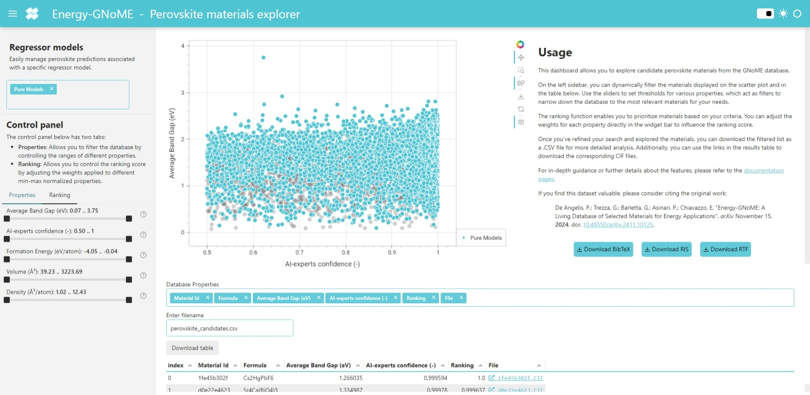

# How to use the *Perovskite* materials dashboard

The Perovskite materials dashboard empowers you to explore candidate perovskite materials from the Energy-GNoME database. This interactive tool enables detailed filtering, ranking, and analysis of materials based on their properties and AI-predicted metrics.

Below is a description of its key features and functionality.

## 1. Interactive Sidebar for Model Selection, Filtering, and Ranking

The Interactive Sidebar provides powerful model selection, filtering, and ranking capabilities. These model preferences, filters, and ranking simultaneously apply to both the **scatter plot** and the **results table**, allowing you to narrow down the dataset dynamically to materials most relevant to your criteria.

### Model Selection:

Choose between:

* **Pure Models**: Predictions are generated by four E3NN regressors trained exclusively on perovskite materials' data, ensuring high accuracy and reliability for this specific class of materials.
* **Mixed Models**: Predictions are generated by four E3NN regressors trained on a broader dataset that includes both perovskites and other materials, offering a more generalized perspective.

### Property Filters

Use sliders to adjust thresholds for key material properties, such as:

* **Average Band Gap (eV)**: Average band gap predicted by the ensemble committee of four E3NN models. Focus on materials with specific electronic properties.
* **AI-Experts Confidence (-)**: Confidence level of the ensemble committee of ten GBDT models in classifying the material as a perovskite. Filter materials based on the reliability of AI predictions.
* **Formation Energy (eV/atom)**: Measure of the average energy required to form the molecule from its constituent atoms. Identify stable candidates by setting energy ranges.
* **Volume (ų)**: Filter based on the physical size of materials.
* **Density (ų/atom)**: Filter based on material density.

### Ranking Functionality

This feature allows you to prioritize materials based on specific criteria by adjusting property weights in the ranking function

$$
R^P(x) = w_1 \cdot n(|E_g(X) - 1.34|) + w_2 \cdot n(P(x)) + w_3 \cdot n(\Delta H_f(x)) + w_4 \cdot n(V(x)) +
$$
$$
\qquad \qquad \quad + w_5 \cdot n(\rho (x)) + w_6 \cdot n(\sigma (E_g(x))) + w_7 \cdot n(\sigma (P(x)))
$$

where:
$ n(x) $ is the min-max normalization function $ n(X) = \frac{x-\mathrm{min}(x)}{\mathrm{max}(x)-\mathrm{min}(x)} $;
$ |E_g(X) - 1.34| $ is the distance of the predicted band gap from the ideal 1.34 eV value;
$ P(x) $ is the confidence level of the AI-Experts;
$ \Delta H_f(x) $

This way, you can tailor the ranking score to your research priorities (e.g., emphasizing band gap over density).
The **table** updates dynamically to reflect the new ranking, ensuring that the most relevant materials are highlighted.

## 2. Scatter Plot Visualization

The central scatter plot provides a graphical representation of the filtered materials.
Each data point represents a material, with:

* **X-axis**: AI-Experts Confidence (-).
* **Y-axis**: Average Band Gap (eV).

Hovering over a data point will display some key information, including its **Material Id**, **Formula**, **Formation Energy**, **Average Band Gap**, and **AI-Experts Confidence**.
