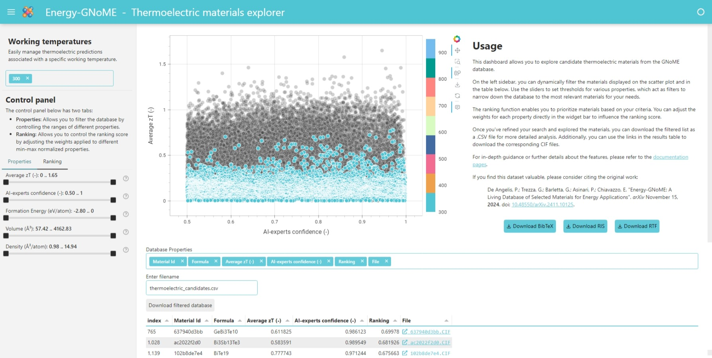
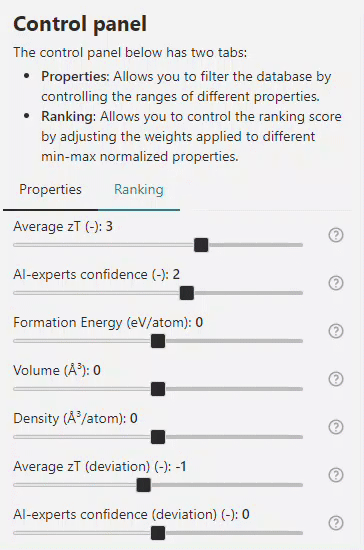
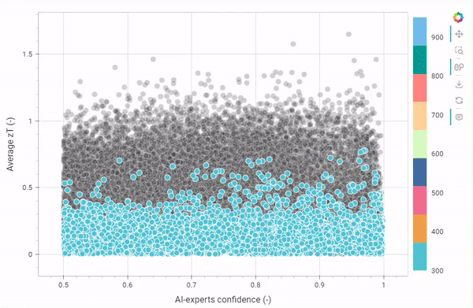
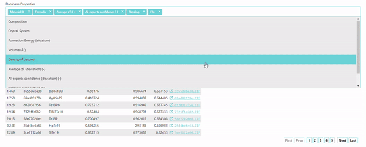

# How to use the *Thermoelectric* materials dashboard

The *Thermoelectric* materials dashboard empowers you to explore candidate **thermoelectric** materials from the Energy-GNoME database. This interactive tool enables detailed filtering, ranking, and analysis of materials based on their properties and AI-predicted metrics.

/// figure-caption
    attrs: {id: fig_dashboard_overview}
Thermoelectric dashboard overview
///

Below is a description of its key features and functionality.

!!! warning
    {align=right width="50px"}
    This app was developed using the [`panel`](https://panel.holoviz.org) Python library and converted into a WebAssembly app using [`pyodide`](https://pyodide.org). It is hosted as a free service on [GitHub Pages](https://pages.github.com).

    As a result, interactions with the dashboard may involve some latency due to local calculations. It is recommended to wait for the loading wheel in the top-right corner to complete before proceeding with further filters or calculations on the database.

## 1. Interactive Sidebar for Working Temperature Selection, Filtering, and Ranking

The Interactive Sidebar provides powerful [working temperature selection](#working-temperature-selection), [filtering](#property-filters), and [ranking](#ranking-functionality) capabilities. These working temperature preferences, filters, and ranking simultaneously apply to both the [scatter plot](#2-scatter-plot-visualization) and the [results table](#3-results-table), allowing you to narrow down the dataset dynamically to materials most relevant to your criteria.

### Working Temperature Selection

    
    

        Choose between predictions generated by four E3NN regressors for thermoelectric materials working at temperatures equal to <strong>300 K</strong>, <strong>430 K</strong>, <strong>560 K</strong>, <strong>690 K</strong>, <strong>820 K</strong>, and <strong>950 K</strong>.
    

### Property Filters

    
    

        Use sliders to adjust thresholds for key material properties, such as:
        <ul>
            <li><strong>Average zT (-)</strong>: Average zT predicted by the ensemble committee of four E3NN models. Focus on materials with specific themoelectric properties;</li>
            <li><strong>AI-Experts Confidence (-)</strong>: Confidence level of the ensemble committee of ten GBDT models in classifying the material as thermoelectric. Filter materials based on the reliability of AI predictions;</li>
            <li><strong>Formation Energy (eV/atom)</strong>: Measure of the average energy required to form the molecule from its constituent atoms. Identify stable candidates by setting energy ranges;</li>
            <li><strong>Volume (ų)</strong>: Filter based on the physical size of materials;</li>
            <li><strong>Density (ų/atom)</strong>: Filter based on material density.</li>
        </ul>
    

### Ranking Functionality

{ align=left width="250px"}

This feature allows you to prioritize materials based on specific criteria by adjusting property weights in the ranking function

$$
\begin{split}
R^P(x) & = w_1 \cdot n(zT(x)) + w_2 \cdot n(P(x)) \\
& + w_3 \cdot n(\Delta H_f(x)) + w_4 \cdot n(V(x)) \\
& + w_5 \cdot n(\rho (x)) + w_6 \cdot n(\sigma (zT(x))) \\
& + w_7 \cdot n(\sigma (P(x))) \\
\end{split}
$$

where:

* $n(x)$ is the min-max normalization function $n(x) = \frac{x-\mathrm{min}(x)}{\mathrm{max}(x)-\mathrm{min}(x)}$;
* $zT(x)$ is the “figure of merit” predicted by the regressors;
* $P(x)$ is the confidence level of the AI-Experts;
* $\Delta H_f(x)$ is the formation energy of the material;
* $V(x)$ is the volume occupied by the molecule;
* $\rho (x)$ is the atomic density of the material;
* $\sigma (zT(x))$ is the standard deviation of the predicted "figure of merit";
* $\sigma (P(x))$ is the standard deviation of the AI-experts prediction.

This way, the ranking score can be tailored according to specific research priorities (e.g., emphasizing zT over density).
The [table](#3-results-table) updates dynamically to reflect the new ranking, ensuring that the most relevant materials are highlighted.

## 2. Scatter Plot Visualization

The central scatter plot provides a graphical representation of the filtered materials.
Each data point represents a material, with:

* **X-axis**: AI-Experts Confidence (-);
* **Y-axis**: Average zT (-).

Hovering over a data point will display some key information, including its **Material Id**, **Formula**, **Formation Energy**, **Average zT**, and **AI-Experts Confidence**.

## 3. Results Table

{ margin="auto" align="center" }

The results table displays detailed information about the filtered materials and is dynamically updated based on your selections in the [Interactive Sidebar](#1-interactive-sidebar-for-working-temperature-selection-filtering-and-ranking).
By default, the table shows key properties such as:

* Material Id;
* Formula;
* Average zT (-);
* AI-experts confidence (-);
* Ranking;
* File.

**Customizable Columns**: Additional properties can be displayed by using the "Database Properties" multichoice widget located above the table. This allows you to tailor the table view to include specific properties that are most relevant to your analysis, including:

* Composition;
* Crystal System;
* Formation Energy (eV/atom);
* Volume (ų);
* Density (ų/atom);
* Model type;
* Average zT (deviation) (-);
* AI-experts confidence (deviation) (-).

You can sort and analyze this data directly within the dashboard.
Links in the **File** column allow you to download the *CIF* files for individual materials, enabling deeper computational or experimental analysis.

## 4. Download Options

Once you've refined the dataset using filters and rankings, you can export the results:

* Download table: Save the filtered data as a .CSV file for further analysis in external tools;
* CIF files: Download structural data files for specific materials directly from the table.

## 5. Additional Resources

For more detailed instructions and advanced use cases, please refer to the [documentation](../../docs/index.md) pages.

If you find this dataset useful, please cite the original work to acknowledge the efforts of the creators:

--8<-- "docs/assets/partial/cite_article.md"
