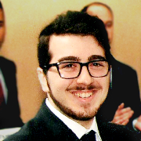
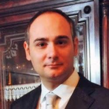

# How to contribute

We warmly welcome contributions, as this project is designed to be a [*living* database](../about_db/index.md){.wiki-hover}.
With iterative rounds of active learning, both regression models and AI-based expert systems can continuously refine the screening process and enhance the accuracy of material property predictions.

Our future plans include the release of a [Python library](../docs/index.md){.wiki-hover} that will enable users to:

- Download and process raw data.
- Repeat the pre-processing steps.
- Build regressor models (E(3)NN and GBDT).
- Train and apply these models for material screening.

This library aims to ensure full reproducibility of the protocol while supporting the ongoing integration of new data into the training set, whether derived from experiments or *ab initio* simulations.

For now, if you would like to explore or leverage Energy-GNoME, please feel free to contact us directly.

-   :octicons-person-fill-24:{ .lg .middle } __Paolo De Angelis, PhD__

    ---

     {.people-image}

    * :fontawesome-solid-circle-arrow-right: : Postdoc
    * :fontawesome-solid-envelope: : [paolo.deangelis@polito.it](mailto:paolo.deangelis@polito.it)
    * :material-web: : [paolodeangelis.github.io](https://paolodeangelis.github.io/)
    * :fontawesome-brands-github: : [paolodeangelis](https://github.com/paolodeangelis)

-   :octicons-person-fill-24:{ .lg .middle } __Giovanni Trezza, PhD__

    ---

     {.people-image}

    * :fontawesome-solid-circle-arrow-right: : Postdoc
    * :fontawesome-solid-envelope: : [giovanni.trezza@polito.it](mailto:giovanni.trezza@polito.it)
    * :material-web: : [polito.it/giovanni.trezza](https://www.polito.it/personale?p=giovanni.trezza)
    * :fontawesome-brands-github: : [giotre](https://github.com/giotre)

-   :octicons-person-fill-24:{ .lg .middle } __Giulio Barletta__

    ---

     {.people-image}

    * :fontawesome-solid-circle-arrow-right: : PhD Student
    * :fontawesome-solid-envelope: : [giulio.barletta@polito.it](mailto:giulio.barletta@polito.it)
    * :material-web: : [giuliobarl.github.io](https://giuliobarl.github.io/)
    * :fontawesome-brands-github: : [giuliobarl](https://github.com/giuliobarl)

-   :octicons-person-fill-24:{ .lg .middle } __Pietro Asinari, PhD__

    ---

     {.people-image}

    * :fontawesome-solid-circle-arrow-right: : Professor
    * :fontawesome-solid-envelope: : [pietro.asinari@polito.it](mailto:pietro.asinari@polito.it)
    * :material-web: : [polito.it/pietro.asinari](https://staff.polito.it/pietro.asinari/)

-   :octicons-person-fill-24:{ .lg .middle } __Eliodoro Chiavazzo, PhD__

    ---

     {.people-image}

    * :fontawesome-solid-circle-arrow-right: : Professor
    * :fontawesome-solid-envelope: : [eliodoro.chiavazzo@polito.it](mailto:eliodoro.chiavazzo@polito.it)
    * :material-web: : [polito.it/eliodoro.chiavazzo](https://www.polito.it/en/staff?p=eliodoro.chiavazzo)

